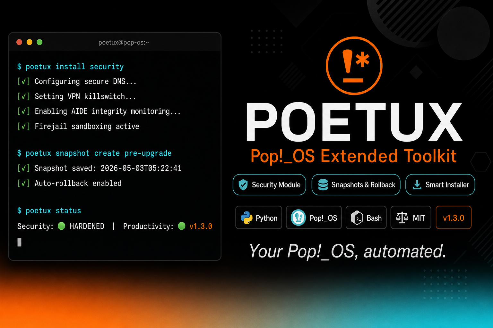

# POETUX — Pop!_OS Extended Toolkit

[](LICENSE)
[](https://python.org)
[](https://pop.system76.com/)
[](CHANGELOG.md)


**Your Pop!_OS, automated.**

Sistema modular de configuración para Pop!_OS orientado a gamers, developers, creadores y streamers.

---

## ¿Qué es POETUX?

Toolkit Bash que automatiza la instalación y configuración de Pop!_OS según tu perfil:
- 🎮 Gaming (Steam, Lutris, MangoHUD)
- 💻 Dev (Git, Python, Rust, Docker, VSCode)
- 🎨 Creators (OBS, GIMP, Blender)
- 🎙️ Streamers (OBS + plugins, Discord)

**Características**:
- Instalación batch (55% más rápida)
- Rollback automático si falla
- Snapshots del sistema
- Bilingüe (ES/EN)
- Modo dry-run

---

## Quick Start (5 minutos)

```bash
# Clonar
git clone https://github.com/drhiidden/POETUX.git
cd POETUX

# Dar permisos
chmod +x poet.sh modules/*.sh lib/*.sh

# Ejecutar (interactivo)
./poet.sh
```

Selecciona el perfil que quieras (1-5) y el script instala todo automáticamente.

**Dry-run** (solo muestra qué haría):
```bash
./poet.sh --dry-run
```

---

## Perfiles Disponibles

| Perfil | Qué instala | Tiempo |
|--------|-------------|--------|
| **Basic** | Actualización sistema, Flatpak, utilidades | 5-10 min |
| **Gaming** | Steam, Lutris, Proton-GE, GameMode | 10-15 min |
| **Dev** | Git, Python, Node.js, Rust, Docker, VSCode | 15-20 min |
| **Creators** | OBS, GIMP, Krita, Kdenlive, Blender | 15-20 min |
| **Streamers** | OBS + plugins, Discord, audio tools | 10-15 min |

Ver detalles: [docs/profiles.md](docs/profiles.md)

---

## Documentación

- **[Instalación Detallada](docs/installation.md)** - Setup completo, requisitos
- **[Perfiles](docs/profiles.md)** - Qué instala cada perfil
- **[Troubleshooting](docs/troubleshooting.md)** - Solucionar problemas
- **[AGENTS.md](AGENTS.md)** - Setup técnico para IA/usuarios
- **[ROADMAP.md](ROADMAP.md)** - Visión futuro
- **[CHANGELOG.md](CHANGELOG.md)** - Historial de versiones
- **[CONTRIBUTING.md](CONTRIBUTING.md)** - Cómo contribuir

---

## Filosofía

- **Modularidad**: Cada módulo hace una cosa bien
- **Opcionalidad**: Pregunta antes de instalar
- **Respeto**: No cambia configs críticas sin confirmar
- **Transparencia**: Código auditable
- **Seguridad**: Privacy-by-design

---

## Licencia

MIT - Ver [LICENSE](LICENSE)

---

**Metodología**: Desarrollado con [HCP (Human-Code-AI Protocol)](https://github.com/haletheia/human-code-ai-protocol)
